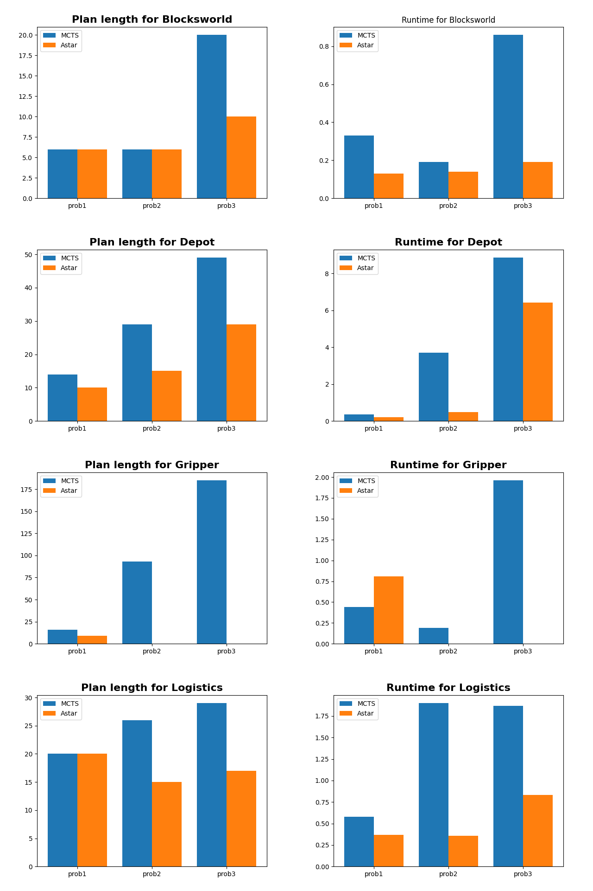

# TP-Monte-Carlo-Tree-Search

## Remarks
We notice that the MCTS algorithms that was implemented isn't as efficient as the Astar in terms of Speed and steps it takes to solve the problem
but despite the Astar good performance in 3 of the benchmarks (Blocksworld, Depot, Logistics) it wasn't able to find a solution in the "Gripper" benchmark
as the problems got harder, the MCTS took a lot of time and steps but it delivered a solution.
