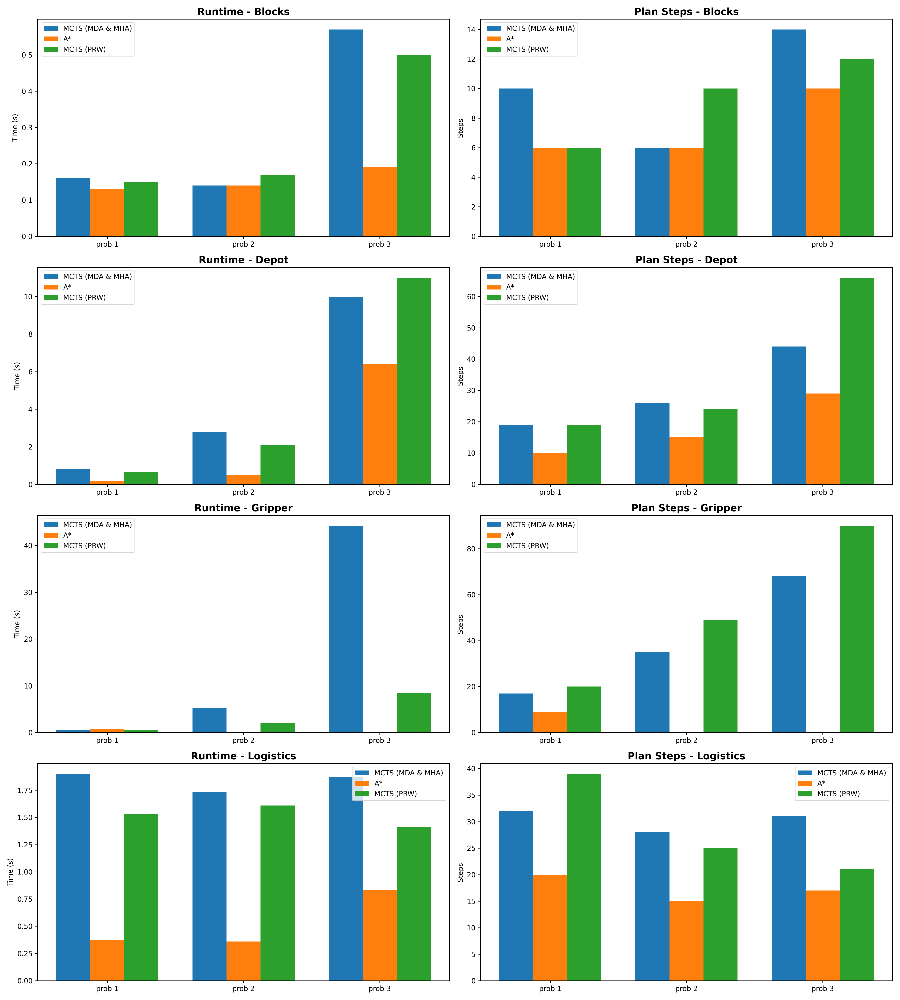

# Monte Carlo Tree Search (MCTS) Planner

## Overview

This repository contains the implementation of a Monte Carlo Tree Search (MCTS) planner for automated planning problems.

## Experimental Setup

* Benchmarks used from PDDL4J’s `pddlproblems/` folder: **blocksworld, depot, gripper, logistics**.
* Each domain contains 3 problem instances of increasing difficulty.
* Comparison performed on:

  * MCTS planner with pure random walks (PRW)
  * MCTS planner with Deadlock Avoidance (MDA) & helpful Actions (MHA) enhancements
  * Baseline HSP A\* planner

---

## Visual Comparison

The following figure summarizes the performance (runtime and plan length) of all three planners (A*, MCTS with pure random walks, and MCTS with MDA & MHA) across all domains:



---

## Results Summary

The results show that the A* planner consistently finds the shortest plans and is fastest on simpler problems, especially in the Blocks and Logistics domains. However, A* struggles or fails on larger, more complex instances like those in the Gripper domain. In contrast, MCTS-based planners, particularly the MCTS with pure random walks (PRW), scale better to complex problems but often produce longer plans and require more computation time. The MCTS with Deadlock avoidance (MDA) and helpful actions (MHA) generally achieves better plan quality than MCTS-PRW but at a higher computational cost. Overall, A* excels in plan optimality and speed for smaller tasks, while MCTS methods provide more robust solutions for larger, harder problems, trading off some efficiency and plan length.

---

## How to Run

1. **Compile the Java planner**

   ```cmd
   javac -d classes -cp lib\pddl4j-4.0.0.jar src\main\java\fr\uga\pddl4j\examples\asp\ASP.java src\main\java\fr\uga\pddl4j\examples\asp\Node.java
   ```

2. **Run benchmarks and generate results**
   Run the provided script (runAll.bat) to execute planners on all benchmarks and collect metrics.

3. **To Test on a certain domain and problem**
   Replace "domain.pddl" and "problem.pddl" with the respective domain and problem names
   ```cmd
   java -cp classes;lib\pddl4j-4.0.0.jar fr.uga.pddl4j.examples.asp.ASP pddlproblems\domain.pddl pddlproblems\problem.pddl
   ```
   
4. **Generate plots**

   ```cmd
   python plot.py
   ```
